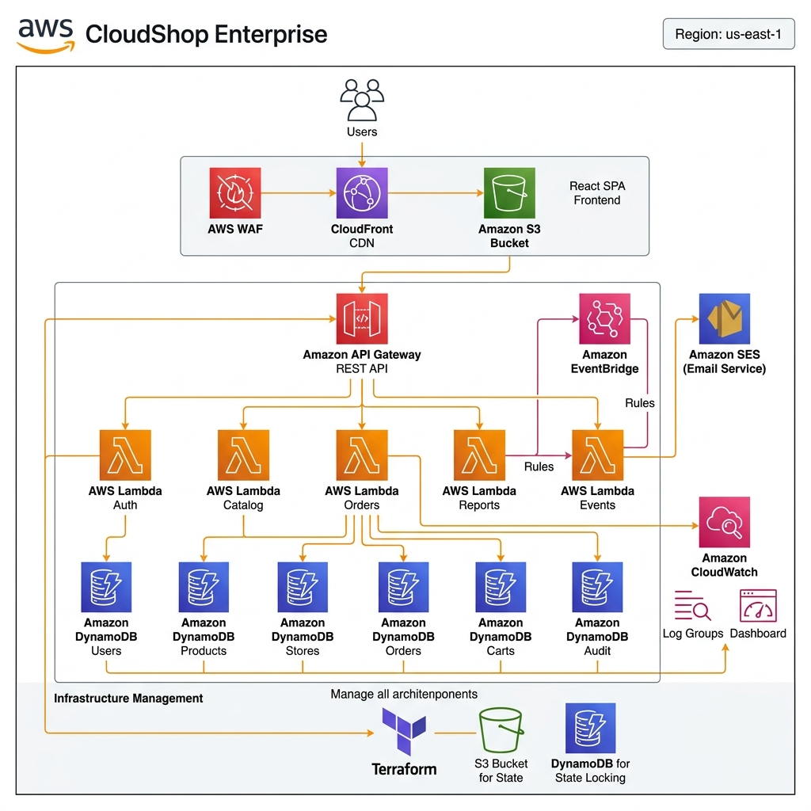

# Architecture Diagrams

Visual diagrams of the CloudShop Enterprise serverless architecture and Infrastructure as Code (IaC).

---

## Diagram Files

| Diagram | Location | Description | Status |
|---|---|---|---|
| **Overall AWS Architecture** | [architecture-diagram.png](../architecture/architecture-diagram.png) | End-to-end diagram with official AWS icons (WAF, CloudFront, S3, API Gateway, Lambdas, DynamoDB, EventBridge, CloudWatch, SES, Terraform). | Completed |
| **Event-Driven Flow** | [architecture-diagram.png](../architecture/architecture-diagram.png) | Asynchronous EventBridge event flow for `ORDER_CREATED` integration with audit and notifications. | Completed |
| **Database Schema** | [dynamodb-schema.md](../database/dynamodb-schema.md) | DynamoDB NoSQL tables and data model specification. | Completed |
| **Security Layers** | [security-overview.md](../security/security-overview.md) | WAF -> API Gateway -> JWT Authorizer -> IAM Roles security layers. | Completed |

---

## Architecture Diagram Preview


