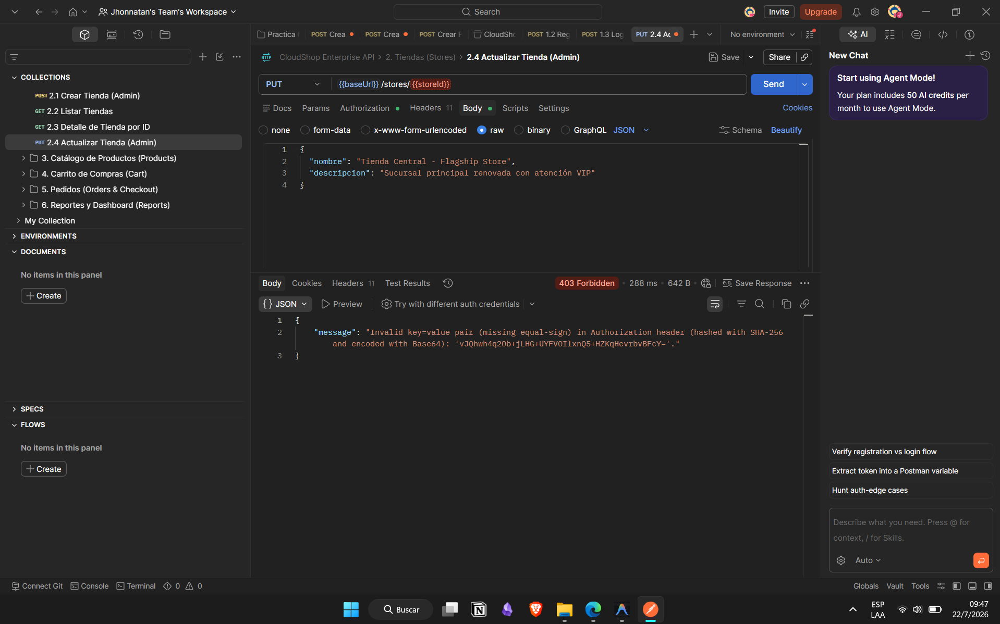
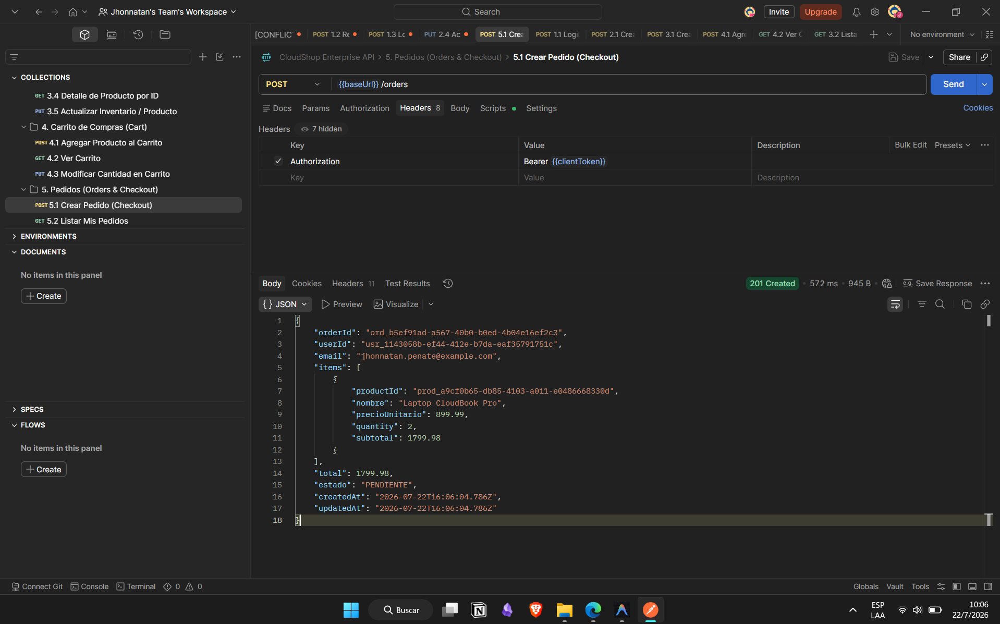
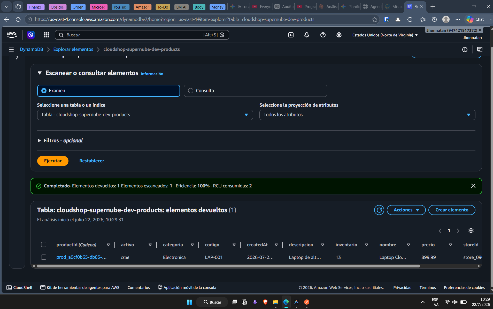
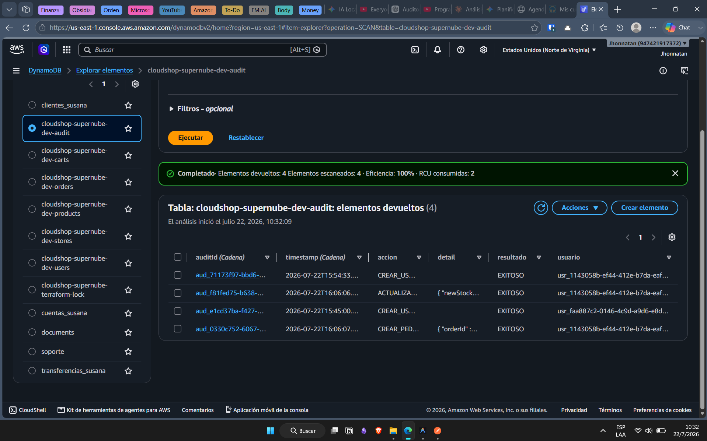
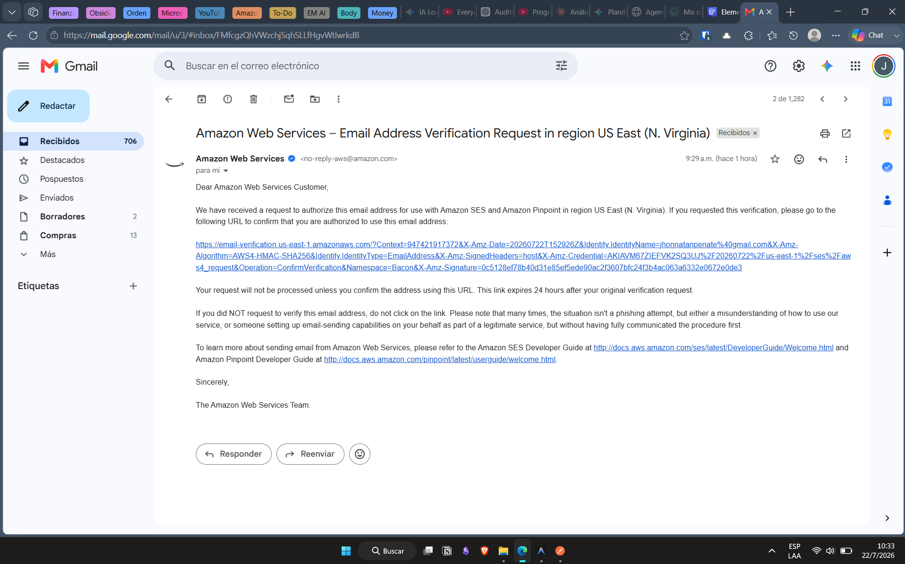
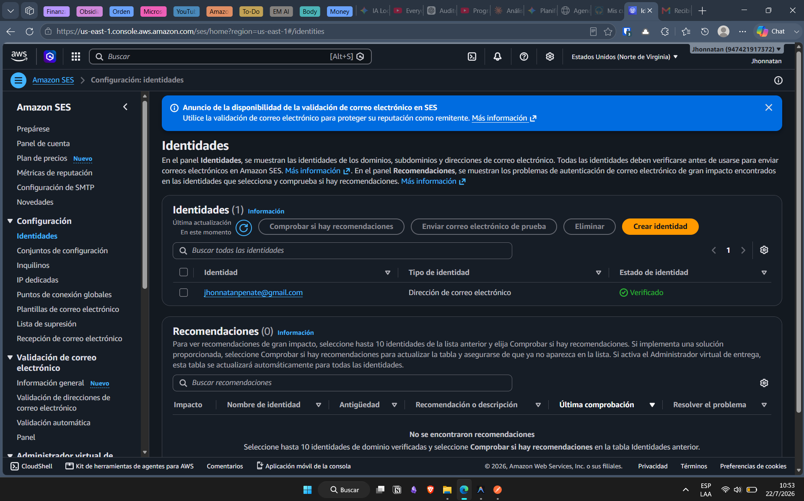

# Evidencias de Ejecucion - Casos de Prueba Obligatorios

Este directorio almacena las capturas de pantalla y registros de Postman y la Consola de AWS que demuestran el cumplimiento de los 4 Casos de Prueba Obligatorios especificados en la rubrica del proyecto final.

---

## Catalogo de Evidencias

### Caso 1: Acceso Sin Permisos (403 Forbidden)
- **Prueba**: Intentar ejecutar `DELETE /products/{{productId}}` con un token de rol `CLIENTE` o sin encabezado de autorizacion.
- **Resultado esperado**: `403 Forbidden` devuelto por API Gateway o el Custom Authorizer.
- **Archivo sugerido**: `caso1_403_prohibido.png`

---

### Caso 2: Creacion Exitosa de Pedido (Extremo a Extremo)
- **Prueba**: Realizar el flujo completo en Postman (Login -> Crear Tienda -> Crear Producto -> Agregar al Carrito -> Checkout POST /orders).
- **Evidencias requeridas**:
  1. **Respuesta de Pedido Creado (201 Created)**:
     - Archivo: `caso2_1_pedido_creado.png`
     - 

  2. **Inventario Actualizado en DynamoDB**:
     - Archivo: `caso2_2_inventario_dynamo.png`
     - 

  3. **Registro de Auditoria en DynamoDB**:
     - Archivo: `caso2_3_auditoria_dynamo.png`
     - 

  4. **Notificacion de Correo Enviada por Amazon SES**:
     - Archivo 4a (Gmail): `caso2_4a_correo_gmail.png`
     - 
     - Archivo 4b (Consola AWS SES): `caso2_4b_ses_consola.png`
     - 

---

### Caso 3: Visualizacion de Metricasy Logs en CloudWatch
- **Prueba**: Acceder a la Consola de AWS -> CloudWatch -> Dashboards o Log Groups.
- **Evidencias**:
  - Archivo: `caso3_cloudwatch.png`
  - 

---

### Caso 4: Despliegue Completo mediante Terraform (100% IaC)
- **Prueba**: Captura de pantalla del terminal con la salida de `terraform apply` mostrando `Apply complete!` y la lista de `Outputs`.
- **Evidencias**:
  - Archivo: `caso4_terraform_apply.png`
  - 

